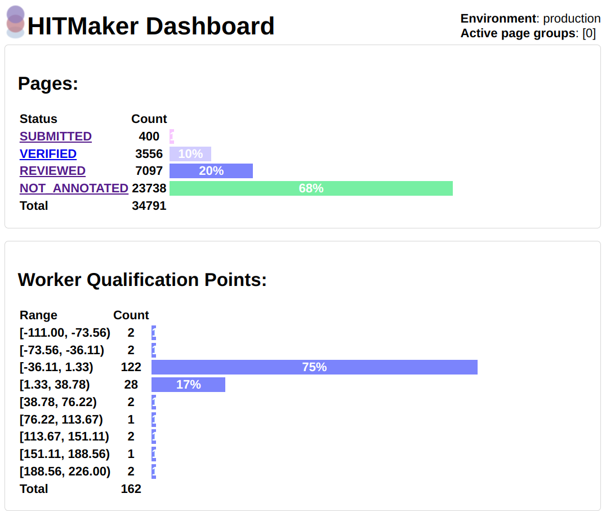
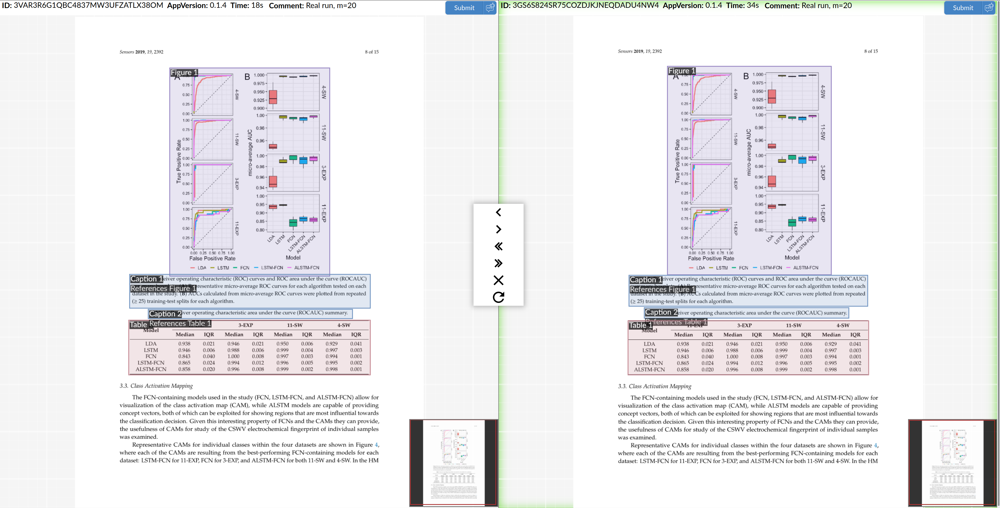

#  HITMaker

Amazon Mechanical Turk back-end system written in python for managing HITs of the task of annotating graphical elements (Figures, Tables and Captions) in scientific publications.

It is meant to be hosted internally and used by the task's creators.
It can even be used by anyone to review submissions and annotate pages without submitting anything to AMT, however multiple people should not use it at the same time (check TODO at the bottom).
It uses [Sci-Annot](https://github.com/Dzeri96/sci-annot) as the front-end for reviewing submissions, and [sci-annot-eval](https://github.com/Dzeri96/sci-annot-eval) for automated comparison of annotation sets.

The tool is unfortunately not very generic, but it should be adaptable to similar annotation tasks.

**DISCLAIMER: Since this was a one-man project used across a whole year, you will have to dig into the code to figure out things work.**
**This README will only give you the basic overview of what the tool is capable of, and some pointers on how to set it up.**

## Screenshots
The dashboard shows you the status of all ingested pages, and the distribution of qualification points of all workers.
This is useful for tweaking the qualification point threshold.


Review mode allows you to compare, edit, and accept/reject worker submissions quickly. 


## Prerequisites
- python3.9
- pip
- pipenv
- MongoDB v6.0.6

To install the dependencies, run 'pipenv install'

## First time setup
You will need to create the following collections in MongoDB manually:
- hit_types
- pages
- pdfs
- qual_requirements
- workers

Every time you want to start work in a new AMT environment (there are basically only two), you have to follow these steps:

1. Create at least one .env file (check .env.example)
2. Create the main HIT type: `python3 manage_HITs.py --env ENVFILE create-hit-type -a`
3. Ingest PDFs from parquet file: `python3 manage_HITs.py -vv -e ENVFILE ingest DOWNLOADED_PDFS_PARQ`
4. Create the qualification types: `python3 manage_HITs.py -vv -e ENVFILE create-qual-types`

## Usage
To show the usage of this system, run
```
python3 manage_HITs.py --help
```
Please check the individual options for each command.

### Workflow

Usually, you would first post qualification pages (one worker per page) in order to build a pool of qualified workers
which will work on the bulk of the HITs.
If you accept a submission, the worker gets +1 qual. point, and -`.env.rejected_assignment_penalty` if their submission is rejected.
You can also edit submissions and save your own version, in which case qual. points will neither be rewarded nor taken away.
Changing your mind is always possible after making a decision, however monetary rewards cannot be taken back once given.


A typical workflow would look like this (qualification stage ignored):

1. Publish some HITs: `python3 manage_HITs.py -v -e ENVFILE publish-random 50 -c "Test"`
2. Fetch the results after some time: `python3 manage_HITs.py -v -e ENVFILE fetch-results`
3. Automatically evaluate fetched results if possible: `python3 manage_HITs.py -v -e ENVFILE eval-retrieved`

### URL parameters
These parameters change the behavior of the front-end:

- `crop_whitespace` - Boolean param, shows a cropped version of the bounding boxes, but doesn't actually change the underlying data in the DB.
- `page_status` - When an action on a page is performed, selects the status of the next page to be loaded. For example `page_status=DEFERRED`.

## TODO
- Write about the security implications of using XML parsers, and how MTurk requesters' servers could be prime targets.
They have money after all
- Implement race condition handling in the API